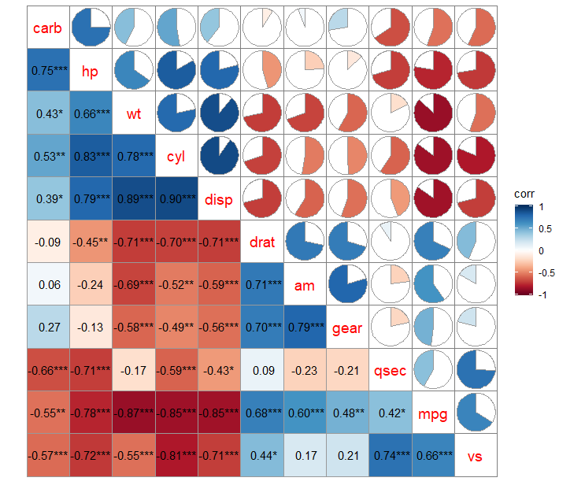

# correlation


# install package of "ggcor" and require
```r
#method_1
if(!require(devtools)){
  install.packages("devtool")
}
if(!require(ggcor)) {
  devtools::install_github("houyunhuang/ggcor")
}
```
```r
#method_2
install.packages("remotes")
remotes::install_github("houyunhuang/ggcor")
```
# processing
```r
df <- fortify_cor(x=mtcars, cor.test = TRUE, cluster.type = "all")#correlation matrix
```
```r
ggcor(df) +
  geom_colour(data = get_data(type = "lower", show.diag = FALSE)) +#setting lower color
  geom_mark(data = get_data(type = "lower", show.diag = FALSE), size = 4) +#setting lower mark
  geom_pie2(data = get_data(type = "upper", show.diag = FALSE))+#setting upper 
  add_diaglab(size = 5, color = "red") + #setting diagonal
  remove_axis()#delete axis labels
```  
  
#more learning for ggcor to 'houyunhuang/ggcor'


